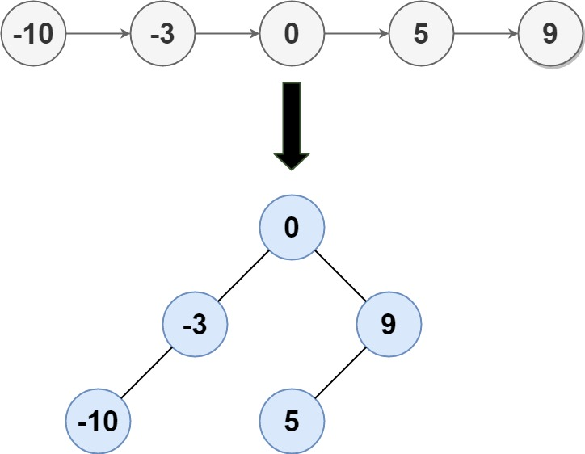

# 109. Convert Sorted List to Binary Search Tree

## Problem

Given the `head` of a singly linked list where elements are **sorted in ascending order**, convert it to a height balanced BST.

For this problem, a height-balanced binary tree is defined as a binary tree in which the depth of the two subtrees of _every_ node never differ by more than 1.

**Example 1:** 

```text
Input: head = [-10,-3,0,5,9]
Output: [0,-3,9,-10,null,5]
Explanation: One possible answer is [0,-3,9,-10,null,5], which represents the shown height balanced BST.
```

**Example 2:**

```text
Input: head = []
Output: []
```

**Example 3:**

```text
Input: head = [0]
Output: [0]
```

**Example 4:**

```text
Input: head = [1,3]
Output: [3,1]
```

**Constraints:**

* The number of nodes in `head` is in the range `[0, 2 * 104]`.
* `-10^5 <= Node.val <= 10^5`

## Solution

```cpp
/**
 * Definition for singly-linked list.
 * struct ListNode {
 *     int val;
 *     ListNode *next;
 *     ListNode() : val(0), next(nullptr) {}
 *     ListNode(int x) : val(x), next(nullptr) {}
 *     ListNode(int x, ListNode *next) : val(x), next(next) {}
 * };
 */
/**
 * Definition for a binary tree node.
 * struct TreeNode {
 *     int val;
 *     TreeNode *left;
 *     TreeNode *right;
 *     TreeNode() : val(0), left(nullptr), right(nullptr) {}
 *     TreeNode(int x) : val(x), left(nullptr), right(nullptr) {}
 *     TreeNode(int x, TreeNode *left, TreeNode *right) : val(x), left(left), right(right) {}
 * };
 */
class Solution {
public:
    TreeNode* sortedListToBST(ListNode* head) {
        if (head == nullptr) return nullptr;
        if (head->next == nullptr) return new TreeNode(head->val);
        ListNode *slow = head, *fast = head->next, *prev = nullptr;
        while (fast != nullptr) {
            prev = slow;
            slow = slow->next;
            fast = fast->next;
            if (fast != nullptr) fast = fast->next;
        }
        TreeNode *root = new TreeNode(slow->val);
        if (prev != nullptr) prev->next = nullptr;
        root->left = sortedListToBST(head);
        root->right = sortedListToBST(slow->next);
        return root;
    }
};
```

* \#tree
* \#linkedlist
* \#recursive

