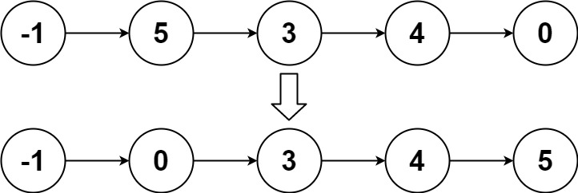

# 148. Sort List

## Problem

Given the `head` of a linked list, return _the list after sorting it in **ascending order**_.

**Follow up:** Can you sort the linked list in `O(n logn)` time and `O(1)` memory \(i.e. constant space\)?

**Example 1:** 

```text
Input: head = [4,2,1,3]
Output: [1,2,3,4]
```

**Example 2:** 

```text
Input: head = [-1,5,3,4,0]
Output: [-1,0,3,4,5]
```

**Example 3:**

```text
Input: head = []
Output: []
```

**Constraints:**

* The number of nodes in the list is in the range `[0, 5 * 104]`.
* `-105 <= Node.val <= 105`

## Solution

```cpp
/**
 * Definition for singly-linked list.
 * struct ListNode {
 *     int val;
 *     ListNode *next;
 *     ListNode() : val(0), next(nullptr) {}
 *     ListNode(int x) : val(x), next(nullptr) {}
 *     ListNode(int x, ListNode *next) : val(x), next(next) {}
 * };
 */
class Solution {
public:
    ListNode* sortList(ListNode *const head) {
        if (head == nullptr || head->next == nullptr) return head;
        ListNode *fast = head->next, *slow = head;
        while (fast != nullptr) {
            fast = fast->next;
            if (fast == nullptr) break;
            fast = fast->next;
            slow = slow->next;
        }
        fast = slow->next;
        slow->next = nullptr;
        return merge(sortList(head), sortList(fast));
    }
    inline ListNode* merge(ListNode* h1, ListNode* h2) {
        ListNode dummy;
        ListNode *const dummy_head = &dummy;
        ListNode *current = dummy_head;
        while (h1 != nullptr && h2 != nullptr) {
            if (h1->val < h2->val) {
                current->next = h1;
                h1 = h1->next;
            } else {
                current->next = h2;
                h2 = h2->next;
            }
            current = current->next;
        }
        if (h1 == nullptr) current->next = h2;
        if (h2 == nullptr) current->next = h1;
        
        return dummy_head->next;
    }
};
```

* \#mergesort
* \#linkedlist

