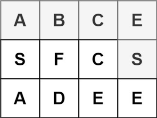
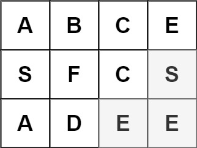

# 79. 	Word Search

## Problem

Given a 2D board and a word, find if the word exists in the grid.

The word can be constructed from letters of sequentially adjacent cells, where "adjacent" cells are horizontally or vertically neighboring. The same letter cell may not be used more than once.

**Example 1:** 

```text
Input: board = [["A","B","C","E"],["S","F","C","S"],["A","D","E","E"]], word = "ABCCED"
Output: true
```

**Example 2:** 

```text
Input: board = [["A","B","C","E"],["S","F","C","S"],["A","D","E","E"]], word = "SEE"
Output: true
```

**Example 3:** 

```text
Input: board = [["A","B","C","E"],["S","F","C","S"],["A","D","E","E"]], word = "ABCB"
Output: false
```

**Constraints:**

* `board` and `word` consists only of lowercase and uppercase English letters.
* `1 <= board.length <= 200`
* `1 <= board[i].length <= 200`
* `1 <= word.length <= 10^3`

## Solution

```cpp
class Solution {
public:
    bool exist(vector<vector<char>>& board, string word) {  
        for (int i = 0; i < board.size(); ++i) {
            for (int j = 0; j < board[0].size(); ++j) {
                if (search(board, word, 0, i, j)) return true;
            }
        }
        return false;
    }
    inline bool search(vector<vector<char>> &board, string &word, int idx, int row, int col) {
        if (row < 0 || col < 0 || row >= board.size() || col >= board[0].size()) return false;
        if (word[idx] == board[row][col]) {
            if (idx == word.size() - 1) return true;
            const char c = board[row][col];
            board[row][col] = '*';
            bool found = search(board, word, idx + 1, row + 1, col) 
                || search(board, word, idx + 1, row , col + 1)
                || search(board, word, idx + 1, row - 1, col)
                || search(board, word, idx + 1, row, col - 1);
            board[row][col] = c;
            return found;
        }
        return false;
    }
};
```

* \#backtracking
* \#dfs

